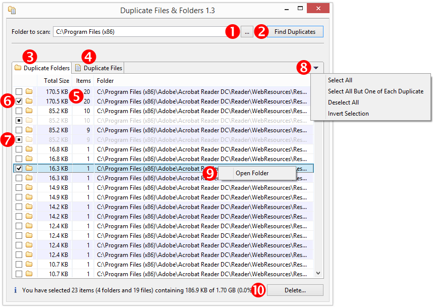
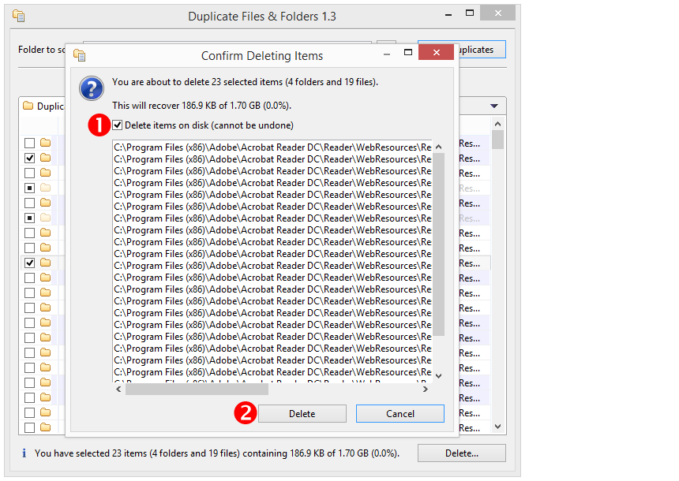

# DuplicateFilesAndFolders

DuplicateFilesAndFolders is an open-source tool to find and (optionally) delete duplicate files and folders, written in Java.

It identifies duplicate files and folders by calculating and comparing file hashes (something that Git does, too). For easy operation, DuplicateFilesAndFolders provides an Eclipse SWT/JFace-based graphical user interface.

I developed DuplicateFilesAndFolders on Windows 7 (64-bit), but it should be easy to port it to other platforms.

Enjoy &mdash; Lorenz

## Table of Contents

* [Getting Started](#getting-started)
* [Usage](#usage)
* [Build Instructions](#build-instructions)
* [Porting Tips](#porting-tips)
* [License](#license)

## Getting Started

### Prerequisites

* You are running a Windows (64-bit) system.
* You have installed Java SDK 7 (or higher) (64-bit) on your system.

### Instructions
**Option 1**
1. Download [DuplicateFilesAndFolders.jar](https://github.com/lwiest/DuplicateFilesAndFolders/releases/download/v2.0/DuplicateFilesAndFolders.jar) to a folder.
2. Open a command prompt in that folder and enter
   ```
   java -jar DuplicateFilesAndFolders.jar
   ```
**Option 2**
1. Download [DuplicateFilesAndFolders.jar](https://github.com/lwiest/DuplicateFilesAndFolders/releases/download/v2.0/DuplicateFilesAndFolders.jar) to the desktop.
2. Double-click _DuplicateFilesAndFolders.jar_ on the desktop.

## Usage



1. Enter or choose a folder to scan.
2. Click _Find Duplicates_ to scan the folder.
3. Inspect the list of duplicate folders.
4. Inspect the list of duplicate files.
5. Duplicate items are grouped by background color.
6. Select a duplicate item for deletion.
7. Child items of selected items are automatically selected and dimmed.
8. (Optional) Select all items, select all but one item of each duplicate item, deselect all items for deletion, or invert your selection.
9. (Optional) Open a folder (or the containing folder of a file) with the context menu.
10. Open the _Confirm Deleting Items_ dialog.



1. Confirm to delete the selected items.
2. Delete the selected items.

:exclamation: **Important: Like with all software able to delete files you are using DuplicateFilesAndFolders at your own risk.** :exclamation:

## Build Instructions

### Prerequisites

* You are running a Windows (64-bit) system.
* You have installed Java SDK 7 (or higher) (64-bit) on your system (I used Java SDK 8 (64-bit)).
* You have installed an Eclipse IDE on your system (I used Eclipse 4.5.0 "Mars" (64-bit)).

### Instructions

1. Download the ZIP file of this project from GitHub.
2. Unzip it to a temporary folder.
3. Import the `DuplicateFilesAndFolders` project from the temporary folder to your Eclipse IDE as an import source _General > Existing Projects into Workspace_.
4. In the _Project Explorer_ view, right-click _DuplicateFilesAndFolders_ and select _Run As > Java Application_.
5. The DuplicateFilesAndFolders application starts. Close it.
6. In the _Project Explorer_ view, right-click _DuplicateFileAndFolders_ and select _Export..._.
7. Select _Java > Runnable JAR file_.
8. Click _Next >_.
9. Under _Launch Configuration_, select _DuplicateFilesAndFolders - DuplicateFilesAndFolders_.
10. Under _Export destination_, enter the full pathname of the exported application, for example `C:\TEMP\DuplicateFilesAndFolders.jar`.
11. Select the radio button _Package required libraries into generated JAR_.
12. Click _Finish_.
13. Use a file explorer to find the exported JAR file `DuplicateFilesAndFolders.jar`.
14. To run the exported JAR file, double-click it.

## Porting Tips

To port DuplicateFilesAndFolders to another platform, apply the following changes:

1. Adjust in method `Utils.getInitialFolderToScanPath()` the string that is shown as the initial folder path.
2. Adjust in method `Utils.getExplorerCommandLine()` the command-line string that launches the file explorer, opening a specific folder.
3. Replace the SWT library `org.eclipse.swt.win32.win32.x86_64_XXX.jar` with the SWT library specific to your platform (Tip: The library name follows the pattern `org.eclipse.swt.<platform>_<version>.v<timestamp>.jar`.).

## License

This project is available under the MIT license.
