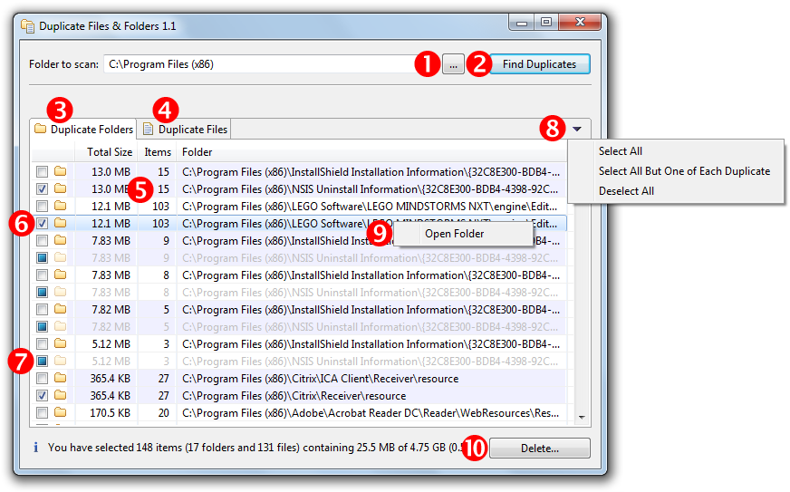
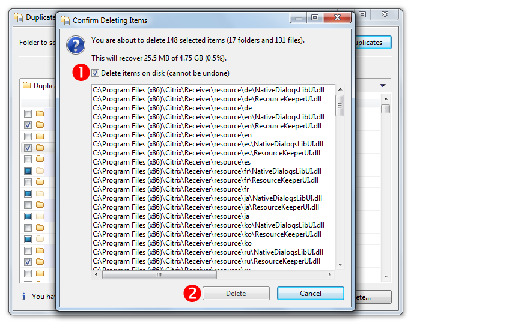

#DuplicateFileAndFolders

Finds and deletes duplicate files and folders, written in Java using an Eclipse SWT/JFace GUI

DuplicateFilesAndFolders is an open-source tool to find and (optionally) delete duplicate files and folders. It identifies duplicate files and folder by calculating and comparing MD5 hashes (something that Git does, too). For easy operation DuplicateFilesAndFolders uses an Eclipse SWT/JFace-based graphical user interface.

I developed DuplicateFilesAndFolders on Windows 7 (64-bit), but it should be easy to port it to other platforms. The DuplicateFileAndFolders source code is available under the MIT license.

Enjoy -- Lorenz

## Getting Started

I prepared a runnable JAR file for the Windows (64-bit) platform.

**Prerequisites:**
* You have Java JDK or SDK installed on your system (I used Java SDK 8 64-bit).

1. Download the Zip-file from GitHub.
2. Unzip it to a temporary folder ("temp folder").
3. In the temp folder, locate the `DuplicateFileAndFolders.jar` file.
4. Double-click this file to run DuplicateFileAndFolders.

## Usage

1. Enter or choose a folder to scan.
2. Click "Find Duplicates" to scan the folder.
3. Inspect the list of duplicate folders.
4. Inspect the list of duplicate files.
5. Duplicate items are grouped by background color.
6. Select a duplicate item for deletion.
7. Child items of selected items are automatically selected and dimmed.
8. Open a folder (or the containing folder of a file) with the context menu.
9. Open the deletion dialog.

1. Confirm to delete the selected items.
2. Delete the selected items.

Important: Like with all software that is able to delete files you are using DuplicateFilesAndFolders at your own risk.

## Build Instructions

I assume you are running a Windows (64-bit) system.

**Prerequisites:**
* You have Java SDK installed on your system (I used Java SDK 8 64-bit).
* You have the Eclipse IDE installed on your system (I used Eclipse 4.5.0 "Mars" 64-bit).

1. Download the Zip-file from GitHub.
2. Unzip it to a temporary folder ("temp folder").
3. Import the "DuplicateFileAndFolders" project from the temp folder in your Eclipse IDE as an import source _General > Existing Projects into Workspace_.
4. Add the required Eclipse libraries:
	1. In the _Project Explorer_ view, right-click on the _DuplicateFileAndFolders_ project and select "Build Path > Configure Build Path..."
	2. Click tab "Libraries".
	3. Remove any JARs with an error marker.
	4. Click the "Add External JARs..." button and add the following libraries:
		* org.eclipse.core.commands_XXX.jar
		* org.eclipse.core.runtime_XXX.jar
		* org.eclipse.equinox.common_XXX.jar
		* org.eclipse.jface_XXX.jar
		* org.eclipse.swt.win32.win32.x86_64_XXX.jar 
		* org.eclipse.swt_XXX.jar
	5. Close the dialog with "OK".
	6. (There should be no error markers anymore in the "Project Explorer" view.)
5. In the "Project Explorer" view, right-click "DuplicateFileAndFolders" and select "Run As > Java Application".
6. (The DuplicateFileAndFolders application starts. Close it.)
7. In the "Project Explorer" view, right-click "DuplicateFileAndFolders" and select "Export...".
8. Select "Java > Runnable JAR file".
9. Click "Next >".
10. Under "Launch Configuration", select "Duplicate FilesAndFolders - Duplicate FilesAndFolders".
11. Under "Export destination", enter the full pathname of the exported application, for example "C:\TEMP\DuplicateFilesAndFolders.jar".
12. Select the radio button "Package required libraries into generated JAR".
13. Click "Finish".
14. With a file explorer find the exported JAR-file at the export location.
15. To run the exported JAR file, double-click it.

## Porting Tips

To port DuplicateFilesAndFodlers to another platform, apply the following changes:

1. Adjust in method Utils.getInitialFolderToScanPath() the string that is shown as the initial folder path.
2. Adjust in method Utils.getExplorerCommandLine() the command-line string that launches the file explorer, opening a specific folder.
3. Replace the library org.eclipse.swt.win32.win32.x86_64_XXX.jar with the SWT library specific to your platform (Hint: the platform name follows the pattern org.eclipse.swt.<platform>_<version>.v<timestamp>.jar).
